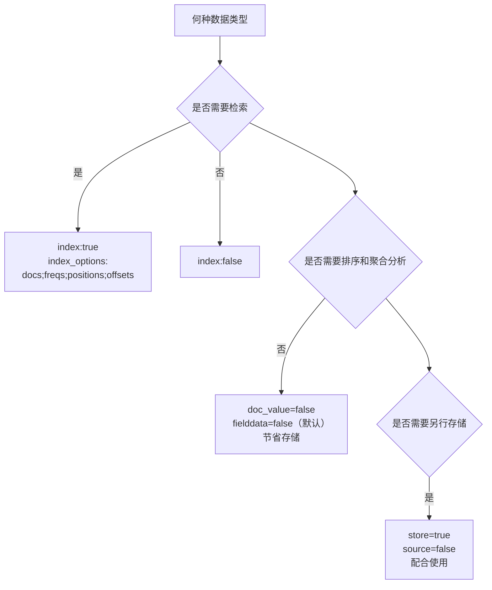

> [巨人的肩膀1](https://mp.weixin.qq.com/mp/appmsgalbum?__biz=MzI2NDY1MTA3OQ==&action=getalbum&album_id=1340073242396114944&scene=173&from_msgid=2247484661&from_itemidx=1&count=3#wechat_redirect)
>
> [巨人的肩膀2](https://blog.csdn.net/weixin_42340670/article/details/111627244)
## es文档模型

segment 段 --> Lucene 索引 --> shard 分片 --> index 

### 涉及操作
+ 创建索引 PUT /indexname
+ 设置分片数量 PUT settings number_of_shards
+ 设置副本数量 number_of_replicas，主分片和副本分片必然在不同节点上
+ 删除索引 DELETE /indexname
+ 压缩 shrink
+ 段合并 force_merge
**注意：**
+ **分片一旦创建，不可以修改分片数量。**
+ **每个分片官方推荐大小为20-40G**
+ **每个段内部文档ID为java的整型，即2^31，总文档数量最大为Integer.MAXVALUE-128=21.4亿条，force_merge后会合并成一个大段**
+ **es中的段只能不断新增和合并（多个小的合并成大的），所以实际上delete_by_query只是对删除的document做标记，触发merge的时候才会真正删除（多个小段合并成一个大段，删除的文档不会被复制到新段里）**

### 分片如何设置
+ 设置多少分片？
    - 单分片建议20-40GB
    - 预估数据总量，即每天新增多少数据，需要存储多久数据
    - 结合上述两点，考虑滚动索引+索引别名形式，分多个索引存储
    - 集群规模多大？存储和内存有多少
+ 设置多少副本
    - 集群规模>2时，建议至少副本为1

### 写性能

####  mapping如何设置

+ 哪些字符串定义为全文检索字段
+ 哪些字段包含数字、日期或者地理位置
+ 定义日期格式（时间戳还是日期类型等）
+ 用于控制动态添加字段的映射的自定义规则

**注意事项**

+ es支持增加字段
```bash
PUT new_index
  {
    "mappings": {
      "_doc": {
        "properties": {
          "status_code": {
            "type":       "keyword"
          }
        }
      }
    }
  }
```
+ es不支持直接删除字段
+ es不支持直接修改字段
+ es不支持直接修改字段类型
---
曲线救国方式：reindex。数据量大时会有性能问题。

---

mapping字段设置流程

一般实战建议采用静态mapping，即手动设置mapping。
+ 可控
+ 节省存储空间（默认string是text+keyword，实际义务不一定需要）


+ 字符串类型，需要分词=text，否则keyword
+ 枚举类型，基于性能，用keyword，即使是整型
+ 数字类型，尽量选择贴近大小的类型 int long float double等
+ 其他类型，bool date 地理位置
核心参数含义：


### 读性能

#### 不需要评分则用filter查询

```json
{
  "query": { 
    "bool": { 
      "filter": [ // 所有的查询都封装到filter上下文里 
        {...}, 
        {...}
      ]
    }
  }
}

```


#### 设置filter_path只返回必要的业务字段

使用es的search api，默认返回的结果里面包含的信息比较多。

```json
{
    "took": 1, // es内部的查询耗时，毫秒
    "timed_out": false, // 查询是否超时
    "_shards":{ // 和本次查询相关的分片信息
        "total" : 1, // 一共涉及到几个分片
        "successful" : 1, // 查询成功的分片个数
        "skipped" : 0, // 跳过的（忽略的）分片个数
        "failed" : 0 // 查询失败的分片个数
    },
    "hits":{ // 查询结果（命中结果）
        "total" : 10, // 满足条件的文档个数
        "hits" : [ // 满足条件的文档
            {
                "_index" : "user_tag", // 文档所属的索引
                "_type" : "default", // 文档所属的类型
                "_id" : "131", // 文档id
                "_score": 0, // 评分（filter查询，该值所有文档都是一样的）
                "_source" : { // 文档的数据（这里才是业务最关心的数据）
                    "user_id" : 131,
                    "frequency": 0,
                    "lifecycle": 1,
                    "contribution": 0,
                    "first_order_time": 0,
                    "monetary": 0,
                    "recency": 2,
                    "total_amount": 0,
                    ....
                }
            }
            ... // 其他文档
        ]
    }
}

```

针对于上面的返回结果，大部分情况下业务逻辑只关心：

- hits.total（满足条件的总数）
- hits.hits._source（满足条件的文档数据）
  这两部分数据。其他的数据不需要，可以没必要返回。和_source同层级的"_index/_type/_id/_score"，这些属性每个文档上都会存在，在大批量循环查询的场景下（每批几百上千，循环很多次），这部分数据的传输和解析耗时也是不容小觑的。这时候就可以通过filter_path指定只返回需要的属性。

```javascript
"filter_path":"hits.total,hits.hits._source"
//注意：filter_path的设置，是一个逗号分隔的字符串。属性名称要包含从顶层节点到自己的所有节点。
//通过这个设置后，返回的结果就是下面的样子：
{
    "hits":{ // 查询结果（命中结果）
        "total" : 10, // 满足条件的文档个数
        "hits" : [ // 满足条件的文档
            {
                "_source" : { // 文档的数据（这里才是业务最关心的数据）
                    "user_id" : 131,
                    ...
                }
            }
            {
                "_source": {
                    ...
                }
            }
            ... // 其他文档
        ]
    }
}
```

#### 设置_source只返回必要的列

```json
{
    "query" : {
        ...
    },
    "_source": ["user_id"]
}
```

#### 不关心文档内容，_source置为false

在上一项内容中介绍过，如果我们业务需求，只是根据各种标签组合来查询用户的id，那么我们最终需要的业务数据只有用户id一项而已。可以通过《"_source": [“user_id”]》这样的设置方式来精简返回结果。在es内部，每个文档都有一个元数据属性"_id"，是文档的唯一标识，可以指定业务上的具有唯一特性的数值，也可以让es自动生成。es的官方讲，自动生成id的算法可以保证唯一，在写入时性能会比较好。如果是业务自定义的id（比如以用户id作为文档id），在新增文档时，都会去校验一下id的唯一性。在用户画像业务上，用户数据是一个持续递增的过程，新的用户注册，就应该会插入一条文档，用户信息变更，就应该修改对应文档。为了便于文档的修改，往往都会以业务上的唯一主键来作为文档的id。所以一条文档的数据信息类似如下：

```json
{
    "_index" : "user_tag",
    "_type" : "default",
    "_id" : "131", // 文档id，和用户id一致
    "_score": 0, 
    "_source" : { 
        "user_id" : 131, // 用户id，和文档id一致。
        ....
    }
}

```

看完上面的数据，再来回顾我们谈论的只返回用户id的需求。我们完全就可以不依赖_source的内容了，只需返回_id就可以了。要达到这样的效果，只需要通过类似下面的设置

```javascript
"filter_path":"hits.total,hits.hits._id"
//就可以得到如下的返回结果
{
    "hits":{
        "total" : 10,
        "hits" : [
            {
                "_id" : 131
            }
            {
                "_id": 132
            }
            ... // 其他文档
        ]
    }
}
```

hits里的数据结果要比第三点设置_source中讨论的最后的返回结果还要精简。但是这只是第一步，返回内容的精简的确会节省带宽占用，减少网络IO，但如果每批次只返回几百上千条这样的数据，性能优势不会特别明显，起码不至于有几十或者上百毫秒的性能差异。

所以，接下来才是重点，es的查询分为两个阶段，query阶段、fetch阶段。

- query阶段：每个分片会返回满足条件的文档id、以及评分，返回到协调节点。
- fetch阶段：协调节点整合各个节点返回的数据，最后确定出哪些文档id对应的文档需要返回给客户端，然后将这些文档id，按所在分片分组后，发送给各个分片对应的查询请求，获取最终的文档。这一阶段取回的文档越多，取回的文档属性越多，性能也会越差。

***所有分片的文档数据获取成功后，在基于客户端的查询设置，统一打包返回给客户端。***

> 关于filter_path，其实是在query、fetch两个阶段都完成后，最后一步打包阶段，把多余的信息排除掉了而已。所以当我们只需要文档id的时候，根本就不需要让es去执行fetch阶段的流程，因为query阶段满足条件的文档id就已经都得到了。

***想要避免fetch阶段的流程，只需要在查询请求中，将_source置为false即可。***

```javascript
{
    "query" : {
        ...
    },
    "_source": false
}
```

> 因数据体量、硬件性能、分页大小都存在差异，在不同的场景下，性能的提升幅度肯定会有差异，这个优化手段应该可以将响应性能缩减几十甚至上百毫秒。

#### 避免深分页

深分页这个问题无论是在传统的关系型数据库如mysql，还是我们现在讨论的es，都会面临性能问题。分页越深，性能越差。尽管性能会变差，但是传统的关系型数据库，也不会限制分页的深度。
但es会，超过他限定的深度，es会返回异常。

```ini
index.max_result_window : 10000
```

max_result_window默认值是10000，这个值的意思是分页查询时，from + size 的值如果超过 10000。 那么将查询失败。

- 1000, 9001：从第1000条再往后查9001条，超出10000限制。
- 9000, 1001：从第9000条再往后查1001条，超出10000限制。

这就意味着，如果你的某个查询，满足条件的超过10000个文档，那么你想用分页把这些文档循环获取出来，是不可能的。因为你最多只能分页取出来10000个。所以一个简单粗暴的方式，就是调大这个设置。但是es以及业内最佳实践其实都不建议这样做。es会建议用scroll api的方式来滚动获取所有的数据。

scroll就像是一个可以中途下车，但不能中途上车的列车。你一定是从头开始，但可以自由决定何时终止查询，哪怕数据还未取完。但是你不能从中间开始。它比较适合后台任务类型的、全量去取数场景，不适合前端交互类、跳页查询的场景。

当然除了scroll，还可以基于自己业务数据上的具有唯一性的数据字段，进行偏移查询（gt、lt），也可以实现全量取数。那么遗留下来的跳页查询怎么办，还是无法解决呀？

> 跳页查询，这个问题往往就是产品和业务层面要做一些折衷了。10000条的限制，20条一页，可以分500页。没有几个人会无聊到一直一页一页的翻500次，前几页如果没有他想要的数据，那么他的操作思路肯定就应该是增加搜索条件了。