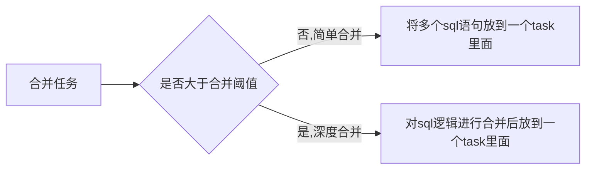
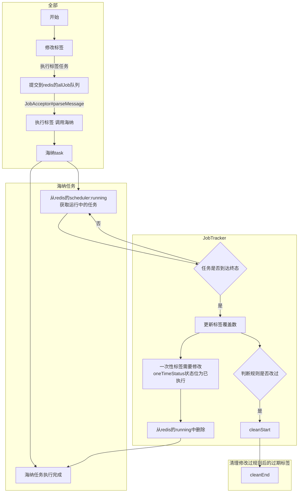

## 周期性标签运行

### 获取需要执行的标签

CronJobLauncher。10s扫描一次

```sql
SELECT i.id,
       i.label_unique_id,
       i.label_name,
       i.label_type,
       i.demand,
       i.rule_descriptor,
       i.rule_hash,
       i.dsl_config,
       i.execute_config,
       i.next_run_time,
       i.rule_recent_updated,
       i.expire_type,
       i.expire_value,
       i.es_type,
       t.cron_config AS tree_cron_config,
       IFNULL(i.cron_config,t.cron_config) AS cron_config,
       t.tree_type_id AS tree_type,
       i.tree_id,
       i.root_label_id,
       i.parent_label_id,
       i.depth,
       i.acc_id,
       i.emails,
       i.del_flag,
       i.create_time,
       i.update_time,
       i.label_count,
       i.one_time_status
FROM t_trident_label_info i
LEFT JOIN t_trident_label_tree t ON t.tree_id = i.tree_id
WHERE i.del_flag = 0
  AND i.execute_config IS NOT NULL
  AND i.dsl_config IS NOT NULL
  AND (i.next_run_time > '1970-01-01 08:00:00'
       AND i.next_run_time <= NOW())
  AND i.one_time_status <> 2
```

桉树id分组

遍历每个分组，如果分组下的标签执行周期 != 树的执行周期，ofSpecialCronJob 立即提交任务（fusion）

否则合并多个标签任务id，ofNormalCronJob 提交任务（merged，waitForBatch=true） 

遍历完成后，更新下次执行时间（nextRunTime）

以上任务提交后都先放在redis的```ds:trident:mq:allJob```​队列中


运行中的任务在 redis的 ```ds:trident:scheduler:running```中


### 任务分发

JobAcceptor。 10s扫描一次 redis中的```ds:trident:mq:allJob```队列

#### fusion

将fusion作业直接提交到海纳执行，sendJobToTracker 放到```ds:trident:scheduler:running```中

#### merged

将merged且waitForBatch=false的，进行合并。ExecutionPlanner.INSTANCE.merge(ImmutableList.of(jobCtx))，然后提交海纳，sendJobToTracker 放到```ds:trident:scheduler:running```中



合并任务相关单元测试可以参考com.datastory.trident.serv.scheduler.ExecutionPlannerTest


将merged且waitForBatch=true的，提交到```ds:trident:mq:mergeJob```队列


```json
{"labelJobIdMap":{"2048":1133541,"2049":1133542,"2050":1133543,"2051":1133544,"2052":1133545,"2053":1133546,"2054":1133547,"2055":1133548,"2056":1133549,"2058":1133550,"2059":1133551,"2060":1133552,"2061":1133553,"2062":1133554,"2063":1133555,"2064":1133556,"2065":1133557,"2066":1133558,"2068":1133559,"2069":1133560,"2070":1133561,"2071":1133562,"2072":1133563,"2073":1133564,"2074":1133565,"2075":1133566,"2076":1133567,"2077":1133568,"2078":1133569,"2079":1133570,"2080":1133571,"2082":1133572,"2083":1133573,"2084":1133574,"2094":1133575,"2095":1133576,"2096":1133577,"2097":1133578,"2098":1133579,"2099":1133580,"2100":1133581,"2101":1133582,"2105":1133583,"2106":1133584,"2107":1133585,"2108":1133586,"2110":1133587,"2111":1133588,"2113":1133589,"2114":1133590,"2115":1133591,"2116":1133592,"2117":1133593,"2118":1133594,"2119":1133595,"2120":1133596,"2122":1133597,"2123":1133598,"2124":1133599,"2125":1133600,"2126":1133601,"2127":1133602,"2128":1133603,"2129":1133604,"2130":1133605,"2131":1133606,"2132":1133607,"2135":1133608,"2136":1133609,"2137":1133610,"2138":1133611,"2139":1133612,"2141":1133613,"2142":1133614,"2143":1133615,"2144":1133616,"2145":1133617,"2146":1133618,"2147":1133619,"2148":1133620,"2149":1133621,"2150":1133622,"2151":1133623,"2153":1133624,"2154":1133625,"2155":1133626,"2156":1133627,"2157":1133628,"2158":1133629,"2159":1133630,"2160":1133631,"2161":1133632,"2163":1133633,"2164":1133634,"2165":1133635,"2166":1133636,"2167":1133637,"2168":1133638,"2169":1133639,"2170":1133640,"2171":1133641,"2172":1133642,"2173":1133643,"2174":1133644,"2175":1133645,"2177":1133646,"2178":1133647,"2179":1133648,"2189":1133649,"2190":1133650,"2191":1133651,"2192":1133652,"2193":1133653,"2194":1133654,"2195":1133655,"2196":1133656,"2200":1133657,"2201":1133658,"2202":1133659,"2203":1133660,"2205":1133661,"2206":1133662,"2208":1133663,"2209":1133664,"2210":1133665,"2211":1133666,"2212":1133667,"2214":1133668,"2215":1133669,"2216":1133670,"2217":1133671,"2218":1133672,"2219":1133673,"2220":1133674,"2221":1133675,"2222":1133676,"2223":1133677,"2224":1133678,"2227":1133679,"2228":1133680,"2229":1133681,"2230":1133682,"2231":1133683,"2233":1133684,"2234":1133685,"2235":1133686,"2236":1133687,"2237":1133688,"2238":1133689,"2239":1133690,"2240":1133691,"2241":1133692,"2242":1133693,"2243":1133694,"2245":1133695,"2246":1133696,"2247":1133697,"2248":1133698,"2249":1133699,"2250":1133700,"2251":1133701,"2252":1133702,"2253":1133703,"2255":1133704,"2256":1133705,"2257":1133706,"2258":1133707,"2259":1133708,"2260":1133709,"2261":1133710,"2262":1133711,"2263":1133712,"2264":1133713,"2265":1133714,"2266":1133715,"2267":1133716,"2269":1133717,"2270":1133718,"2271":1133719,"2273":1133720,"2278":1133721,"2280":1133722,"2298":1133723,"2299":1133724,"2300":1133725,"2301":1133726,"2302":1133727,"2303":1133728,"2304":1133729,"2305":1133730,"2309":1133731,"2310":1133732,"2311":1133733,"2312":1133734,"2314":1133735,"2315":1133736,"2317":1133737,"2318":1133738,"2319":1133739,"2320":1133740,"2321":1133741,"2322":1133742,"2323":1133743,"2324":1133744,"2326":1133745,"2327":1133746,"2328":1133747,"2329":1133748,"2330":1133749,"2331":1133750,"2332":1133751,"2333":1133752,"2334":1133753,"2335":1133754,"2336":1133755,"2339":1133756,"2340":1133757,"2341":1133758,"2342":1133759,"2343":1133760,"2345":1133761,"2346":1133762,"2347":1133763,"2348":1133764,"2349":1133765,"2350":1133766,"2351":1133767,"2352":1133768,"2353":1133769,"2354":1133770,"2355":1133771,"2357":1133772,"2358":1133773,"2359":1133774,"2360":1133775,"2361":1133776,"2362":1133777,"2363":1133778,"2364":1133779,"2365":1133780,"2367":1133781,"2368":1133782,"2369":1133783,"2370":1133784,"2371":1133785,"2372":1133786,"2373":1133787,"2374":1133788,"2375":1133789,"2376":1133790,"2377":1133791,"2378":1133792,"2379":1133793,"2381":1133794,"2382":1133795,"2383":1133796,"2405":1133797,"2406":1133798,"2407":1133799,"2408":1133800,"2409":1133801,"2410":1133802,"2411":1133803,"2412":1133804,"2416":1133805,"2417":1133806,"2418":1133807,"2419":1133808,"2421":1133809,"2422":1133810,"2424":1133811,"2425":1133812,"2426":1133813,"2427":1133814,"2428":1133815,"2429":1133816,"2430":1133817,"2431":1133818,"2433":1133819,"2434":1133820,"2435":1133821,"2436":1133822,"2437":1133823,"2438":1133824,"2439":1133825,"2440":1133826,"2441":1133827,"2442":1133828,"2443":1133829,"2446":1133830,"2447":1133831,"2448":1133832,"2449":1133833,"2450":1133834,"2452":1133835,"2453":1133836,"2454":1133837,"2455":1133838,"2456":1133839,"2457":1133840,"2458":1133841,"2459":1133842,"2460":1133843,"2461":1133844,"2462":1133845,"2464":1133846,"2465":1133847,"2466":1133848,"2467":1133849,"2468":1133850,"2469":1133851,"2470":1133852,"2471":1133853,"2472":1133854,"2474":1133855,"2475":1133856,"2476":1133857,"2477":1133858,"2478":1133859,"2479":1133860,"2480":1133861,"2481":1133862,"2482":1133863,"2483":1133864,"2484":1133865,"2485":1133866,"2486":1133867,"2488":1133868,"2489":1133869,"2490":1133870,"2509":1133871,"2510":1133872,"2515":1133873,"2528":1133874,"2529":1133875,"1622":1133876,"1623":1133877,"1624":1133878,"1625":1133879,"1626":1133880,"1627":1133881,"1628":1133882,"1629":1133883,"1633":1133884,"1634":1133885,"1635":1133886,"1636":1133887,"1638":1133888,"1639":1133889,"1641":1133890,"1642":1133891,"1643":1133892,"1644":1133893,"1645":1133894,"1646":1133895,"1647":1133896,"1648":1133897,"1650":1133898,"1651":1133899,"1652":1133900,"1653":1133901,"1654":1133902,"1655":1133903,"1656":1133904,"1657":1133905,"1658":1133906,"1659":1133907,"1660":1133908,"1663":1133909,"1664":1133910,"1665":1133911,"1666":1133912,"1667":1133913,"1669":1133914,"1670":1133915,"1683":1133916,"1684":1133917,"1685":1133918,"1686":1133919,"1687":1133920,"1688":1133921,"1689":1133922,"1690":1133923,"1691":1133924,"1693":1133925,"1694":1133926,"1695":1133927,"1696":1133928,"1698":1133929,"1699":1133930,"1700":1133931,"1701":1133932,"1702":1133933,"1704":1133934,"1705":1133935,"1706":1133936,"1707":1133937,"1708":1133938,"1709":1133939,"1710":1133940,"1711":1133941,"1712":1133942,"1713":1133943,"1714":1133944,"1715":1133945,"1716":1133946,"1718":1133947,"1719":1133948,"1720":1133949,"1783":1133950,"1784":1133951,"1785":1133952,"1786":1133953,"1787":1133954,"1788":1133955,"1789":1133956,"1790":1133957,"1794":1133958,"1795":1133959,"1796":1133960,"1797":1133961,"1799":1133962,"1800":1133963,"1805":1133964,"1806":1133965,"1807":1133966,"1808":1133967,"1809":1133968,"1811":1133969,"1812":1133970,"1813":1133971,"1814":1133972,"1815":1133973,"1816":1133974,"1817":1133975,"1818":1133976,"1819":1133977,"1820":1133978,"1821":1133979,"1824":1133980,"1825":1133981,"1826":1133982,"1827":1133983,"1828":1133984,"1830":1133985,"1831":1133986,"1832":1133987,"1833":1133988,"1834":1133989,"1835":1133990,"1836":1133991,"1837":1133992,"1838":1133993,"1839":1133994,"1840":1133995,"1842":1133996,"1843":1133997,"1844":1133998,"1845":1133999,"1846":1134000,"1847":1134001,"1848":1134002,"1849":1134003,"1850":1134004,"1852":1134005,"1853":1134006,"1854":1134007,"1855":1134008,"1856":1134009,"1857":1134010,"1858":1134011,"1859":1134012,"1860":1134013,"1861":1134014,"1862":1134015,"1863":1134016,"1864":1134017,"1866":1134018,"1867":1134019,"1868":1134020,"1884":1134021,"1885":1134022,"1886":1134023,"1887":1134024,"1888":1134025,"1889":1134026,"1890":1134027,"1891":1134028,"1895":1134029,"1896":1134030,"1897":1134031,"1898":1134032,"1900":1134033,"1901":1134034,"1903":1134035,"1904":1134036,"1905":1134037,"1906":1134038,"1907":1134039,"1908":1134040,"1909":1134041,"1910":1134042,"1912":1134043,"1913":1134044,"1914":1134045,"1915":1134046,"1916":1134047,"1917":1134048,"1918":1134049,"1919":1134050,"1920":1134051,"1921":1134052,"1922":1134053,"1925":1134054,"1926":1134055,"1927":1134056,"1928":1134057,"1929":1134058,"1931":1134059,"1932":1134060,"1933":1134061,"1934":1134062,"1935":1134063,"1936":1134064,"1937":1134065,"1938":1134066,"1939":1134067,"1940":1134068,"1941":1134069,"1943":1134070,"1944":1134071,"1945":1134072,"1946":1134073,"1947":1134074,"1948":1134075,"1949":1134076,"1950":1134077,"1951":1134078,"1953":1134079,"1954":1134080,"1955":1134081,"1956":1134082,"1957":1134083,"1958":1134084,"1959":1134085,"1960":1134086,"1961":1134087,"1962":1134088,"1963":1134089,"1964":1134090,"1965":1134091,"1967":1134092,"1968":1134093,"1969":1134094,"1999":1134095,"2000":1134096,"2001":1134097,"2002":1134098,"2003":1134099,"2004":1134100,"2005":1134101,"2006":1134102,"2010":1134103,"2011":1134104,"2012":1134105,"2013":1134106,"2015":1134107,"2016":1134108,"2018":1134109,"2019":1134110,"2020":1134111,"2021":1134112,"2022":1134113,"2023":1134114,"2024":1134115,"2025":1134116,"2027":1134117,"2028":1134118,"2029":1134119,"2030":1134120,"2031":1134121,"2032":1134122,"2033":1134123,"2034":1134124,"2035":1134125,"2036":1134126,"2037":1134127,"2040":1134128,"2041":1134129,"2042":1134130,"2043":1134131,"2044":1134132,"2046":1134133,"2047":1134134},"waitForBatch":true,"jobType":"MERGED","treeId":256,"treeTypeId":497}
```


### 合并的任务

BatchJobAcceptor。2小时扫描一次

处理过程同merged 且watiForBatch=false，只是多了个等待时间，会收到多个jobCtx，ExecutionPlanner.INSTANCE.merge(jobCtxList)


<font color="#FF000">**难点在于合并任务的逻辑处理。@see com.datastory.trident.serv.scheduler.ExecutionPlanner#merge**</font>


## 修改标签规则


### 任务终态定义
```java

this.equals(SUCCESS) || this.equals(TIMEOUT) || this.equals(KILLED) || this.equals(FAILED) || this.equals(SYS_KILLED) || this.equals(SYS_FAILED)
```

